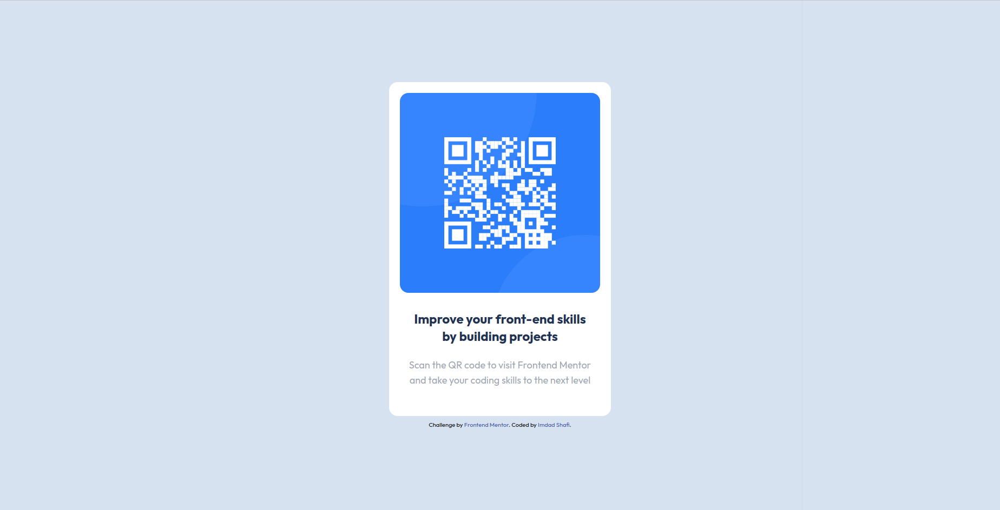

# Frontend Mentor - QR code component solution

This is a solution to the [QR code component challenge on Frontend Mentor](https://www.frontendmentor.io/challenges/qr-code-component-iux_sIO_H). Frontend Mentor challenges help you improve your coding skills by building realistic projects. 

## Overview

### Screenshot

### Links

- Solution URL: [Add solution URL here](https://github.com/imdadshafi/qr-code-component-main)
- Live Site URL: [Add live site URL here](https://qr-code-component-main-two-iota.vercel.app/)

## My process

### Built with

- Tailwindcss
- Mobile-first workflowf
- vite

## Author

- Website - [Imdad Shafi](https://imdadshafi.com)
- Frontend Mentor - [@imdadshafi](https://www.frontendmentor.io/profile/imdadshafi)
- Twitter - [@imdadshafi](https://www.twitter.com/imdadshafi)

